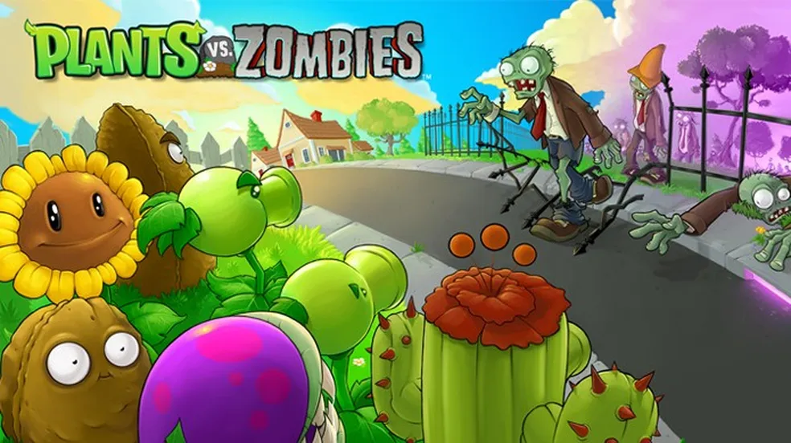
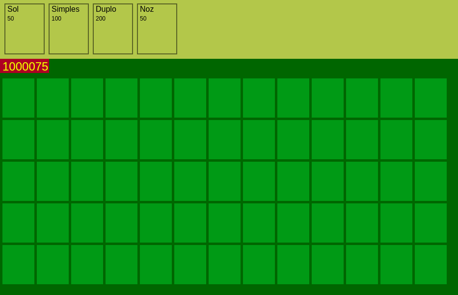
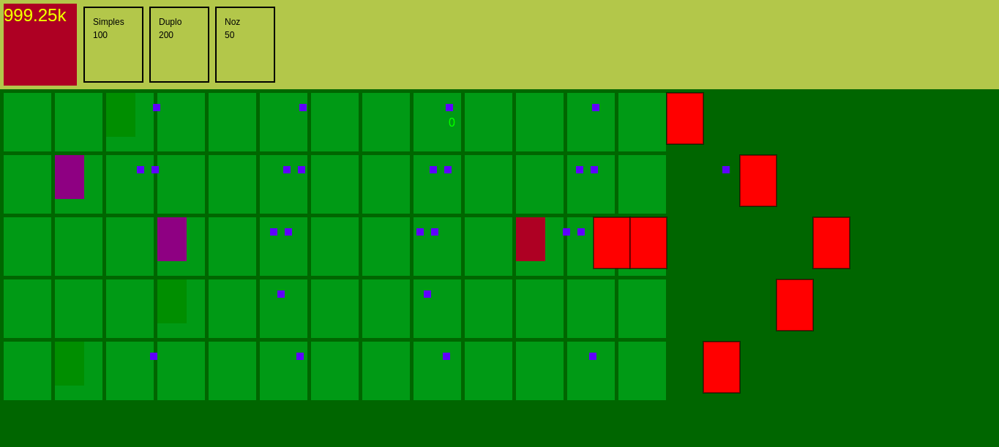

# Planta vs Zombie

Este é um projeto inspirado no clássico jogo "Plants vs. Zombies". O objetivo é criar uma versão personalizada utilizando JavaScript para fins de aprendizado e diversão.

<div align="center">

</div>

## Funcionalidades

- **Defesa estratégica**: Posicione plantas para defender sua base contra os zumbis.
- **Diferentes tipos de plantas e zumbis**: Cada um com habilidades únicas.
- **Progressão de níveis**: Aumente a dificuldade conforme avança no jogo.

## Tecnologias Utilizadas

- **HTML5**: Canvas.
- **JavaScript**: Lógica e interatividade.

## Diagrama de Classe

O diagrama acabou ficando muito grande para ser apresentado aqui, então vou deixar o caminho para vê-lo:

- [diagrama-classes.svg](./docs/img/Planta%20vs%20Zombie%20-%20Diagrama.svg)

## Como Executar

1. Clone o repositório:

```bash
git clone https://github.com/seu-usuario/planta-vs-zombie.git
```

2. Navegue até o diretório do projeto:

```bash
cd planta-vs-zombie
```

3. Abra o arquivo `src/index.html` no navegador.

## Amostra do jogo (por enquanto)

### Grid e painel com os itens (plantas) para usar.

<div align="center">

</div>

### Jogo com os elementos agindo.

<div align="center">

</div>

---

Divirta-se jogando e aprendendo!
